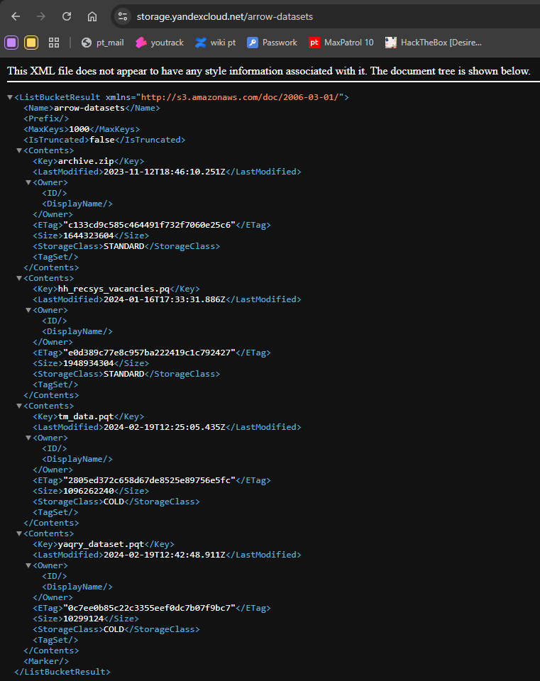
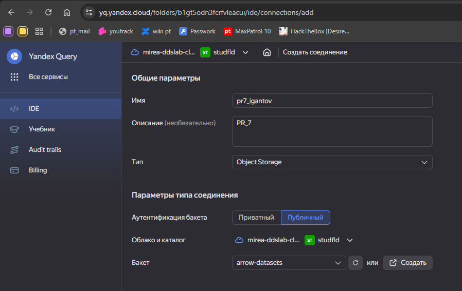
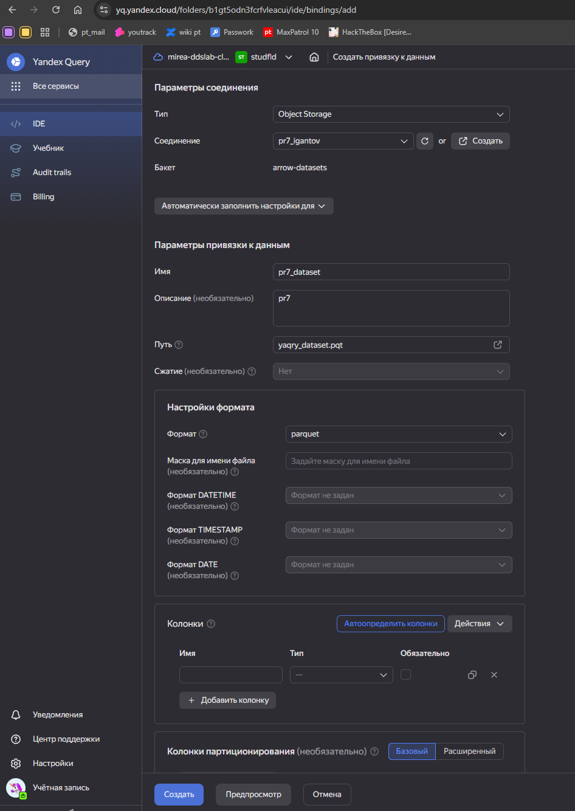
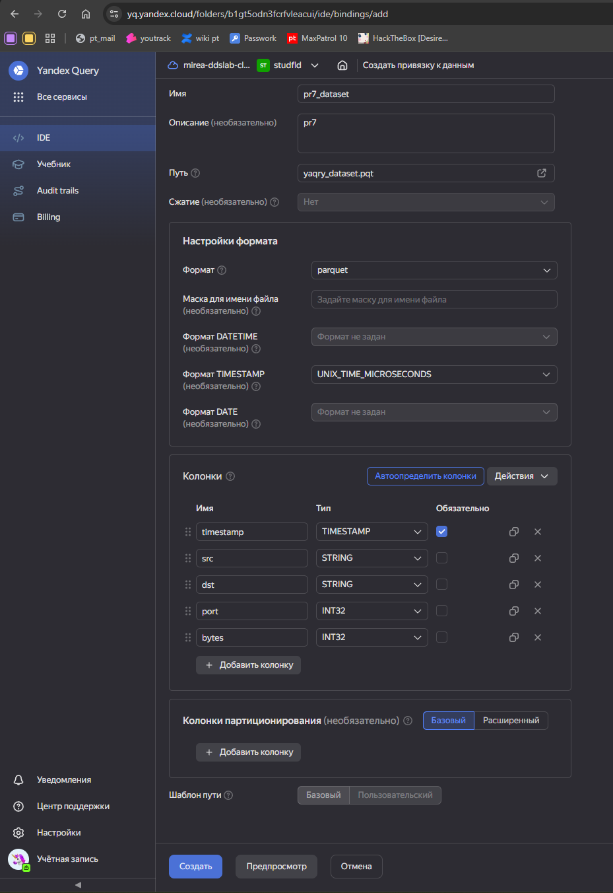
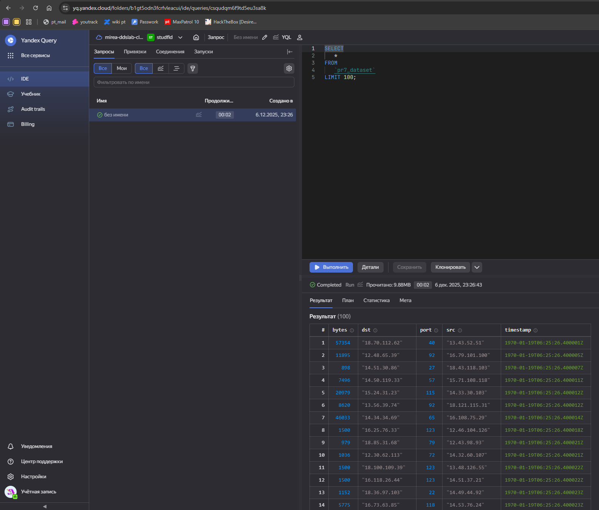
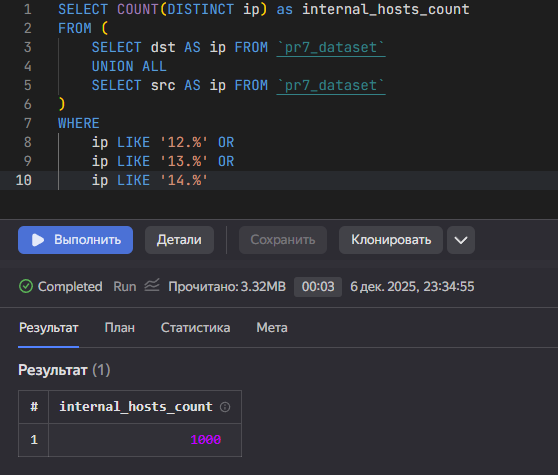
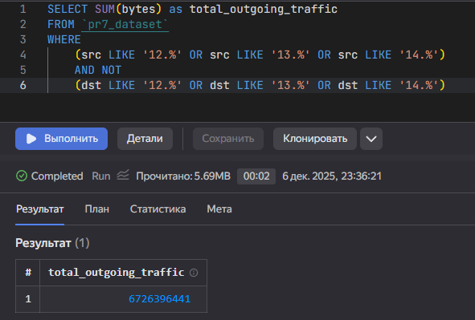
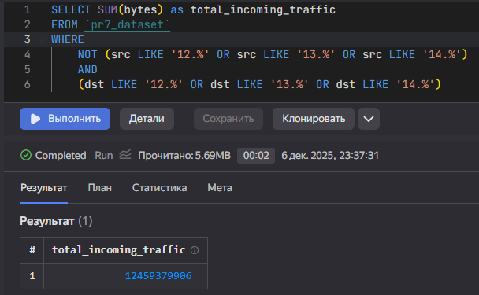

## Цель работы

1. Изучить возможности технологии Yandex Query для анализа структурированныхнаборов данных
2. Получить навыки построения аналитического пайплайна для анализа данных с помощью сервисов Yandex Cloud
3. Закрепить практические навыки использования SQL для анализа данных сетевой активности в сегментированной корпоративной сети


## Исходные данные

1. Оепрационная система Windows 11 
2. RStudio
3. Интерпретатор языка R
4. Yandex Cloud

## Задание 

Используя сервис Yandex Query настроить доступ к данным, хранящимся в сервисе хранения данных Yandex Object Storage. При помощи соответствующих SQL запросов ответить на вопросы


## Впоросы
1. Проверить доступность данных в Yandex Object Storage
2. Подключить бакет как источник данных для Yandex Query
3. Известно, что IP адреса внутренней сети начинаются с октетов, принадлежащих интервалу [12-14]. Определить количество хостов внутренней сети, представленных в датасете.
4. Определить суммарный объем исходящего трафика
5. Определить суммарный объем входящего трафика


## Выполнение задания

```{r}
sessionInfo()
```


### 1. Проверка доступности данных




### 2. Подключим бакет как источник данных для Yandex Query
1. Создадим соединение для бакета в S3 хранилище

2. Перейдем к настройке привязки данных

3. Далее настроим состав и формат данных

4. Сделаем первый запрос
```
SELECT
   *
FROM
   `pr7_dataset`
LIMIT 100;
```


### 3. Определим количество хостов внутренней сети, представленных в датасете.
```
SELECT COUNT(DISTINCT ip) as internal_hosts_count
FROM (
    SELECT dst AS ip FROM `pr7_dataset`
    UNION ALL
    SELECT src AS ip FROM `pr7_dataset`
)
WHERE 
    ip LIKE '12.%' OR 
    ip LIKE '13.%' OR 
    ip LIKE '14.%'
```


### 4. Определим суммарный объем исходящего трафика
```
          SELECT SUM(bytes) as total_outgoing_traffic
FROM `pr7_dataset`
WHERE 
    (src LIKE '12.%' OR src LIKE '13.%' OR src LIKE '14.%')
    AND NOT
    (dst LIKE '12.%' OR dst LIKE '13.%' OR dst LIKE '14.%')
```


### 5. Определитм суммарный объем входящего трафика
```
          SELECT SUM(bytes) as total_incoming_traffic
FROM `pr7_dataset`
WHERE 
    NOT (src LIKE '12.%' OR src LIKE '13.%' OR src LIKE '14.%')
    AND 
    (dst LIKE '12.%' OR dst LIKE '13.%' OR dst LIKE '14.%')
```


## Оценка результатов и вывод

В ходе выполнения практической работы были изучены возможности технологии Yandex Query для анализа структурированных данных. Приобретены навыки построения аналитического пайплайна с использованием сервисов Yandex Cloud. Закреплены практические навыки применения SQL для анализа данных сетевой активности в сегментированной корпоративной сети. Проведен разведочный анализ данных сетевой активности компании XYZ, хранящихся в Yandex Object Storage, и получены ответы на поставленные вопросы.
