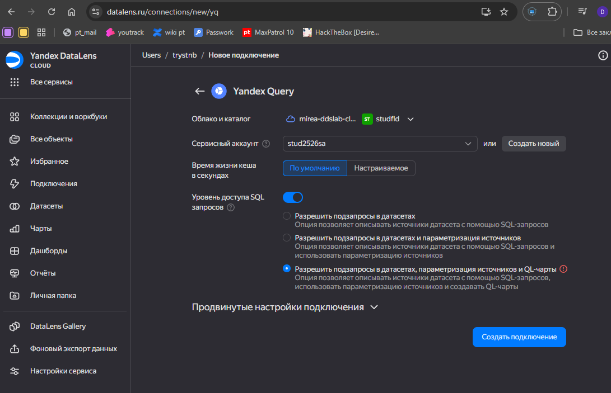
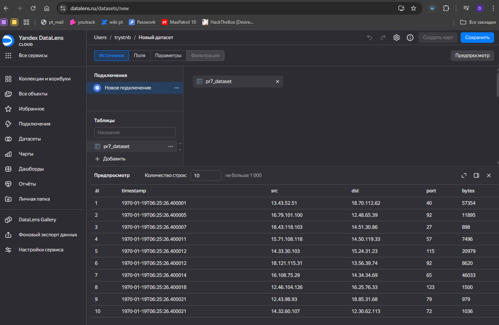
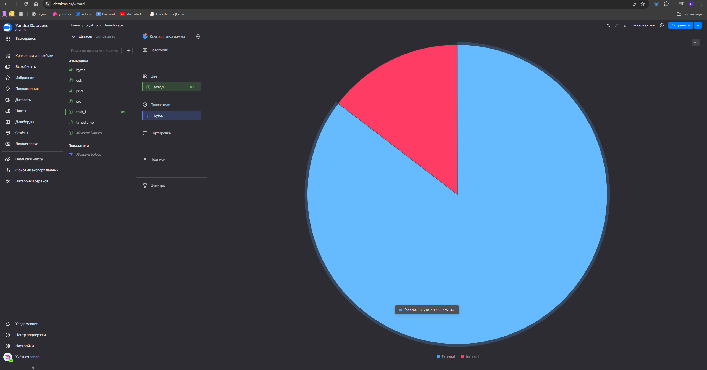
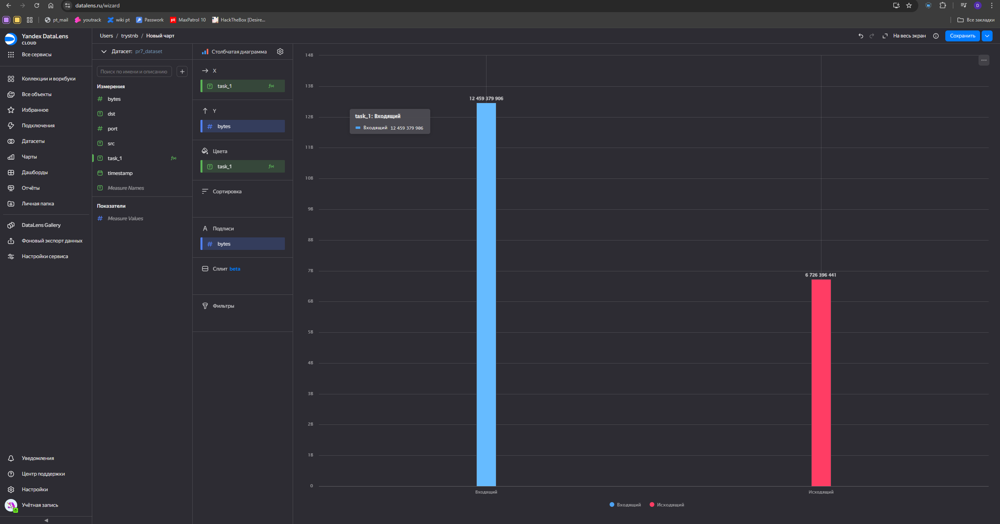
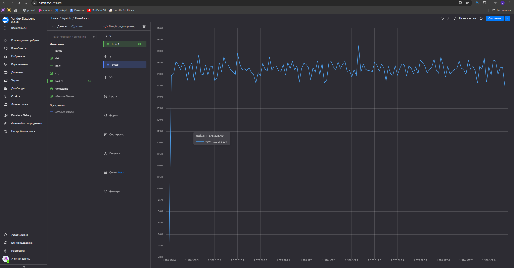
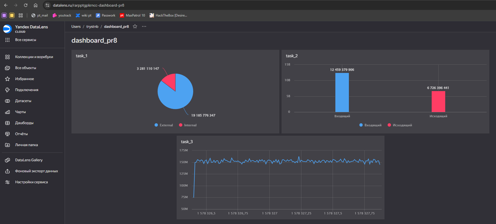

## Цель работы

1. Изучить возможности технологии Yandex DataLens для визуального анализа структурированных наборов данных
2. Получить навыки визуализации данных для последующего анализа с помощью сервисов Yandex Cloud
3. Получить навыки создания решений мониторинга/SIEM на базе облачных продуктов и открытых программных решений
4. Закрепить практические навыки использования SQL для анализа данных сетевой активности в сегментированной корпоративной сети


## Исходные данные

1.  Оепрационная система Windows 11 
2.  RStudio
3.  Yandex DataLens
     

## Задание 

Используя сервис Yandex DataLens настроить доступ к Yandex Query, который Вы использовали в ходе ранее выполненных практических работ, и визуально представить результаты анализа данных.


## Впоросы

1. Представить в виде круговой диаграммы соотношение внешнего и внутреннего сетевого трафика.
2. Представить в виде столбчатой диаграммы соотношение входящего и исходящего трафика из внутреннего сетвого сегмента.
3. Построить график активности (линейная диаграмма) объема трафика во времени.
4. Все построенные графики вывести в виде единого дашборда в Yandex DataLens.

## Выполнение задания

```{r}
sessionInfo()
```


### 1. Настроить подключение к Yandex Query из DataLens

Настроим и проверим подключение Yandex Query из DataLens


Создадим из запроса YandexQuery датасет DataLens. Для этого перетащим из левой колонки результаты доступных запросов как датасет в правую часть экрвна. 


### 2. Представить в виде круговой диаграммы соотношение внешнего и внутреннего сетевого трафика.
```
IF 
    (STARTSWITH([src], "12.") OR STARTSWITH([src], "13.") OR STARTSWITH([src], "14."))
    AND
    (STARTSWITH([dst], "12.") OR STARTSWITH([dst], "13.") OR STARTSWITH([dst], "14."))
THEN 
    "Internal"
ELSE 
    "External"
END
```


### 3. Представить в виде столбчатой диаграммы соотношение входящего и исходящего трафика из внутреннего сетвого сегмента.
```
IF 
    NOT STARTSWITH([src], "12.") 
    AND NOT STARTSWITH([src], "13.") 
    AND NOT STARTSWITH([src], "14.")
    AND 
    (STARTSWITH([dst], "12.") 
     OR STARTSWITH([dst], "13.") 
     OR STARTSWITH([dst], "14."))
THEN 
    "Входящий"

ELSEIF 
    (STARTSWITH([src], "12.") 
     OR STARTSWITH([src], "13.") 
     OR STARTSWITH([src], "14."))
    AND 
    (NOT STARTSWITH([dst], "12.") 
     AND NOT STARTSWITH([dst], "13.") 
     AND NOT STARTSWITH([dst], "14."))
THEN 
    "Исходящий"

END
```


### 4. Построить график активности (линейная диаграмма) объема трафика во времени.
```
ROUND(FLOAT([timestamp]) / 1000000, 2)
```


### 5. Все построенные графики вывести в виде единого дашборда в Yandex DataLens.

[Ссылка на итоговый дашборд](https://datalens.ru/rarpptgpkrncc-dashboard-pr8)


## Оценка результатов и вывод

Отчёт написан и оформлен
